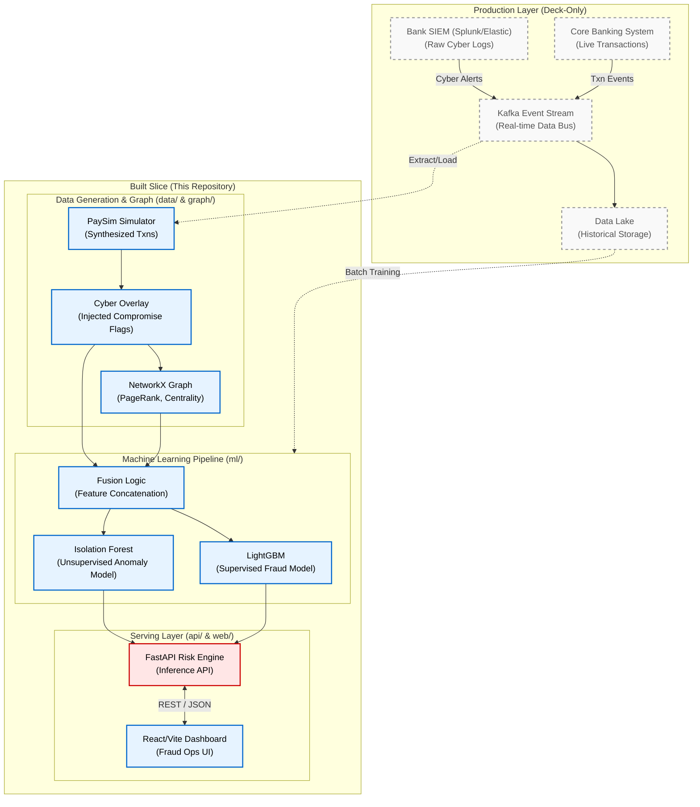

# Architecture: Built Slice vs. Production Layer

This diagram illustrates the current "built slice" (what is implemented in this repository) versus the full "production layer" (what would be deployed in a live bank environment).

